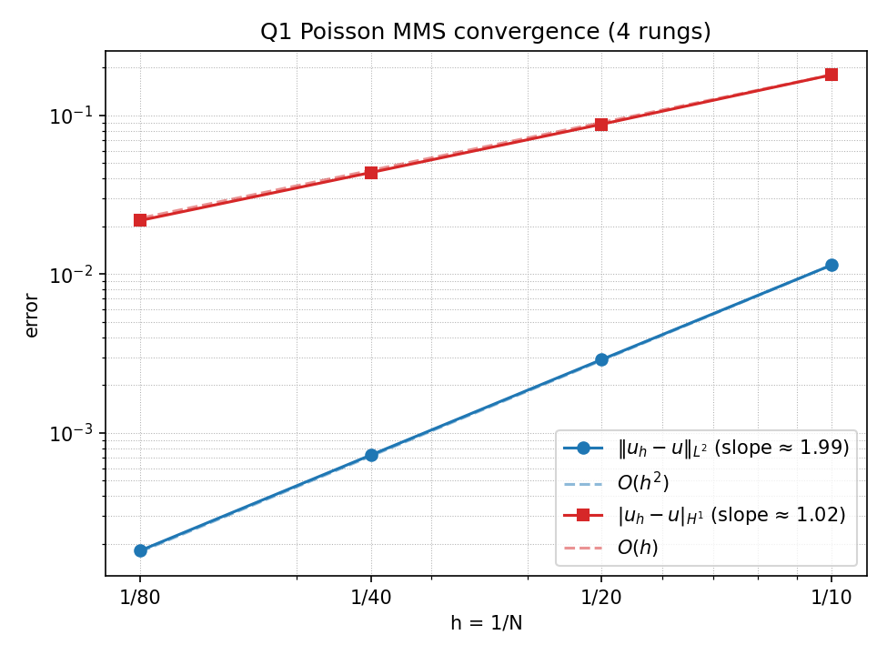

# Claude Code Demo — 3D FE Poisson Solver

A one-shot prompt-driven development demo: Claude Code implements a
basic 3D unstructured finite element Poisson solve on Trilinos
(Tpetra/Belos/MueLu, STK mesh) from a single prompt
([`prompt.md`](./prompt.md)). Expected end state: a working solver
that passes a Q1 MMS convergence sweep (L² error at O(h²), H¹ at
O(h)) on `np=1` and `np=4`, with a log-log convergence plot written
to `results/poisson_mms_q1_convergence.png`.

Expected wall time with Opus 4.7 on `/effort max` and Trilinos pre-built per §7 is roughly **1–2 hours** end-to-end.

## Reference convergence (gold)

Checked in under [`gold/`](./gold/) as the pass/fail reference for
future runs:



|   n | L² error      | H¹-seminorm error |
|----:|--------------:|------------------:|
|  10 | `2.90959e-3`  | `1.74238e-1`      |
|  20 | `7.27067e-4`  | `8.72061e-2`      |
|  40 | `1.81748e-4`  | `4.36142e-2`      |
|  80 | `4.54357e-5`  | `2.18085e-2`      |

Fitted slopes: **L² = 2.00**, **H¹ = 1.00** — matches the Q1 theory
(`O(h²)` in L², `O(h)` in H¹). After a fresh run, diff the emitted
`results/poisson_mms_q1_convergence.csv` against
`gold/poisson_mms_q1_convergence.csv`; each value should agree to
at least 2–3 significant figures.

## Disclaimer — run at your own risk

The author accepts no liability for damage to your machine,
accounts, or data. Read this section before launching the container.

All contents, including both this `README.md` and [`prompt.md`](./prompt.md) were drafted by
Opus 4.7. Reading them and deciding whether their claims hold for
your setup is on **you**, not on the author.

[`.claude/settings.json`](./.claude/settings.json) hands Claude Code
a wide-open allowlist — `Bash`, `Read`, `Edit`, `Write`, `Task`, and
`Web Search` all run without prompting. A personal, gitignored
[`settings.local.json`](./.claude/settings.local.json) overlay adds
`WebFetch` for `github.com` and `raw.githubusercontent.com`.
Practical consequences:

- Any content Claude pulls in — web search results, fetched GitHub
  pages, files inside `/demo` — can attempt **prompt injection**.
  A successful injection can run arbitrary shell inside the
  container, modify host files through the `.` bind mount, and
  exfiltrate the container's Anthropic OAuth token (ephemeral to
  this container's lifetime).
- The container is hardened (non-root, `no-new-privileges`,
  loopback-only SSH) but it is **not a sandbox**. Bind-mounted
  files are real host files.
- Tighten or remove entries in `.claude/settings.json` before
  running this against anything you care about.

The rest of this README walks through the Podman + SSH setup the
demo was authored against. §11 sketches VSCode Dev Containers you can use instead. Linux hosts skip §1.

## Prerequisites

Install Homebrew if `brew` is missing:

```bash
/bin/bash -c "$(curl -fsSL https://raw.githubusercontent.com/Homebrew/install/HEAD/install.sh)"
```

On Apple Silicon the installer prints an `eval "$(/opt/homebrew/bin/brew shellenv)"`
line — append it to `~/.zprofile` and open a new terminal.

```bash
brew install podman podman-compose
brew install --cask iterm2
ssh-keygen -t rsa   # if you don't already have a key
```

iTerm2 (≥ 3.5) gives native `tmux -CC`. Claude Code prompts for
browser OAuth on first run; an Anthropic account is all you need.

The compose file bind-mounts `~/.ssh/id_rsa.pub` as
`authorized_keys`. If you use a different key, update
[`docker-compose.yml`](./docker-compose.yml).

## 1. Start the Podman machine (macOS)

```bash
podman machine init --cpus 4 --memory 8192   # first time only
podman machine start
```

The default 2 CPU / 2 GiB is tight. For an existing machine, resize
with `podman machine set --cpus N --memory N` (stop + set + start).

## 2. Configure git identity

Create `.env.local` (gitignored) at the repo root:

```
GIT_USER_EMAIL=you@example.com
GIT_USER_NAME=Your Name
```

The entrypoint applies these as `git config --global` for `demo`.

## 3. Build + start

```bash
podman-compose up --build -d
```

Runs `sshd` on `127.0.0.1:2222`, drops to `demo` for `bash`, and
pre-creates a `tmux` session `main`. Stop with `podman-compose down`.

## 4. SSH in

```bash
ssh -p 2222 demo@localhost
```

You land as `demo` in `/demo` (bind-mounted from the host).

## 5. iTerm2 `tmux -CC` (optional, recommended)

Attach to the `main` session so work persists across disconnects:

```bash
ssh -t -p 2222 demo@localhost tmux -CC attach -t main
```

`tmux` windows/panes become native iTerm2 tabs/panes.

## 6. VSCode Remote-SSH (optional)

The exposed SSH port also drives the
[Remote - SSH](https://marketplace.visualstudio.com/items?itemName=ms-vscode-remote.remote-ssh)
extension (§11 covers the more native Dev Containers route). Add to
`~/.ssh/config`:

```
Host demo-dev
    HostName localhost
    Port 2222
    User demo
    IdentityFile ~/.ssh/id_rsa
```

Then `⌘⇧P → Remote-SSH: Connect to Host… → demo-dev → Open Folder
→ /demo`. Language servers and terminals run inside the container;
the editor UI stays on the host.

## 7. Pre-build Trilinos

Run this once before launching Claude so the agent can jump
straight to writing code instead of paying the ~20-min TPL build.

```bash
cd /demo
bash scripts/build_trilinos.sh
```

Pass `--clean` if you ever need to wipe the install prefixes and
rebuild from scratch (source clones are kept).

## 8. Launch Claude Code

```bash
cd /demo
claude
```

First run opens an OAuth URL; the token lives only inside the
container, so every `podman-compose up --build` requires a fresh
login. At the Claude prompt, enter `/plan` mode, then submit:

```
Follow the instructions in @prompt.md.
```

Prefer Gemini? `gemini` is installed in the image, so `gemini` in
place of `claude` runs the same flow against Google's CLI.

## 9. Security posture

Local-dev only:

- Container runs as UID 1000 (`demo`); entrypoint does
  `exec gosu demo "$@"`. MPI is non-root by construction.
- `security_opt: [no-new-privileges:true]` blocks setuid escalation.
- SSH: pubkey-only, loopback-bound, `PermitRootLogin no`,
  `PasswordAuthentication no`.
- CLI versions are frozen at image build. Rebuild to upgrade.
- Bind mounts: `.` and your SSH pubkey. Host CLI state
  (`~/.claude`, `~/.gemini`) is not mounted, so CLI MEMORY.md does
  not persist across rebuilds.

## 10. Reset

```bash
podman-compose down                            # stop
podman-compose up --build --no-cache -d        # fresh image
```

## 11. VSCode Dev Containers (alternative)

For an editor-native alternative to §3–§8, point the
[Dev Containers](https://code.visualstudio.com/docs/devcontainers/containers)
extension at a `.devcontainer/devcontainer.json` that references
this `Dockerfile` (or `docker-compose.yml`), then run `Reopen in
Container`. Advantages over the SSH flow above:

- One-step lifecycle — VSCode builds, starts, and attaches; no
  separate `podman-compose up` + `ssh`.
- No `sshd` in the image — VSCode tunnels through the container
  engine's exec API, so port 22 and the `authorized_keys` bind-mount
  go away. Smaller attack surface.
- Declarative extension install via `customizations.vscode.extensions`
  and `postCreateCommand` / `postStartCommand` hooks replace the
  `docker-entrypoint.sh` choreography in a portable way.
- The `.devcontainer/` format is also consumed by GitHub Codespaces
  and JetBrains Gateway, not just VSCode.

You can ask Claude itself to bootstrap this from the current setup —
e.g. *"port the Podman/SSH layout to a VSCode dev container: emit
`.devcontainer/devcontainer.json` from the current `Dockerfile` and
`docker-compose.yml`, drop sshd, and move the entrypoint logic into
`postCreateCommand`."*
